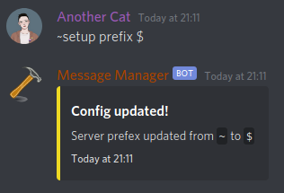
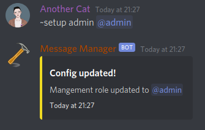
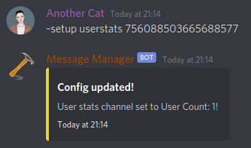

# Config

For the bot to function you are required to set server configuration  
For each config command if you leave out the field in `<>` it will output the current setting.

All config commands are locked to users with administration permissions

If you put `None` in the place of the setting it will either remove the setting or reset it to it's default value.

`~setup admin None`

## Prefix

The default prefix is `~`

To set a prefix do `~setup prefix <prefix>`  
The default prefix will no longer work in this server  
However mentioning the bot is always a prefix no matter what the set prefix.

## Management role

This role will allow access to message management commands. These are `~send`, `~edit`, `~delete` and `~fetch`.

Set role with `~setup admin <role>`  
`<role>` Can be either the role id or mentioning the role.

## Bot Stats Voice Channel

This will set the voice channel to update bot numbers to.  
See the stats page for more info

Set this with `~setup botstats <channel>`

`<channel>` Must be the id of a voice channel.  
This requires the bot to have manage channel on this channel.

## Member Stats Voice Channel

This will set the voice channel to update member numbers to.

Set this with `~setup userstats <channel>`

Must be the id of a voice channel.  
This requires the bot to have manage channel on this channel.

